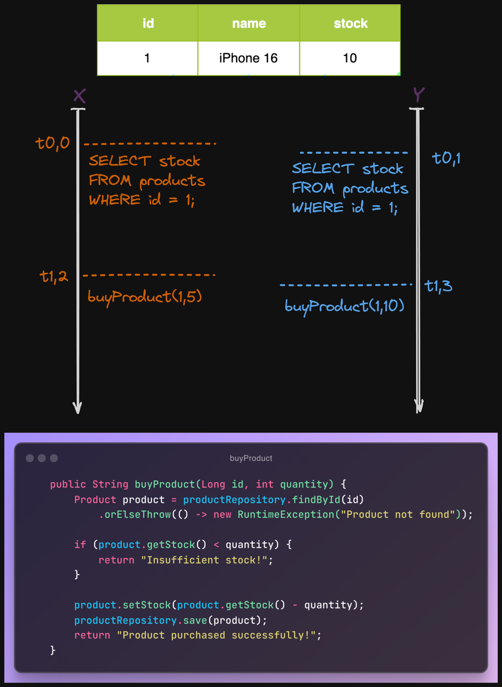

# pessimistic_optimistic_locking

# Sunum Kaydi:
[Spring Boot ile Pessimistic ve Optimistic Locking](https://www.youtube.com/watch?v=FPZVr5qVq44)

    https://www.youtube.com/watch?v=FPZVr5qVq44


<p align="center">
    
</p>

## Pessimistic Locking Nedir?

Spring Boot'ta *Pessimistic Locking* (Kotumser Kilitleme), veritabani tablosundaki bir kaynaga ayni anda birden fazla islem yapilmasini engelleyerek verilerin tutarliligini korumak icin kullanilir. Pessimistic Locking kullanildiginda, bir islem veriyi guncellemeye veya okumaya baslamadan once kilit alir ve diger islemlerin bu kilit kalkana kadar veriye erisimini engeller.

---

### Pessimistic Locking Avantajlari ve Dezavantajlari

#### Avantajlari

1. **Veri Tutarliligi ve Guvenlik**:
    - Ayni anda birden fazla islem tarafindan guncellenmesi gereken verilerde tutarliligi saglar. Ozellikle finansal islemler veya stok guncellemeleri gibi veri cakismasinin buyuk zararlara yol acabilecegi durumlarda idealdir.

2. **Cakismalari Onleme**:
    - Bir veri kaynagini bir islem kilitlediginde, diger islemler kilit cozulene kadar beklemek zorunda kalir, bu da veri cakismasini onler.

3. **Anlik Erisim Kontrolu**:
    - Kilitler sayesinde veriye anlik erisim kontrolu saglanir. Guncelleme islemleri sirasinda diger islemlerin ayni veriye erisimi sinirlandirilir.

4. **Ongorulebilirlik ve Islem Guvenligi**:
    - Pessimistic locking, sik sik guncelleme yapilan sistemlerde islemlerin daha ongorulebilir olmasini saglar ve veri isleme sirasinda islemlerin guvenli bir sekilde siralanmasini temin eder.

#### Dezavantajlari

1. **Performans Sorunlari**:
    - Kilit mekanizmasi kuruldugunda, veritabani uzerinde ek yuk olusur. Bu da sistemin genel performansini dusurebilir.

2. **Bekleme ve Tikaniklik**:
    - Bir islem bir veri kaynagi uzerinde kilitli kaldiginda, diger islemler bu kaynaga erismek icin beklemek zorunda kalir, bu durum tikanikliga neden olabilir.

3. **Olceklenebilirlik Sinirlamalari**:
    - Kilitler, cok kullanicili ve yuksek hacimli uygulamalarda veritabani performansini etkileyebilir, bu da sistemi olceklendirmeyi zorlastirir.

4. **Olu Kilitlenme Riski**:
    - Ayni kaynaklar uzerinde birden fazla islem yapmaya calisan islemler arasinda olu kilitlenmelere yol acabilir.

5. **Kilit Yonetimi Zorluklari**:
    - Pessimistic locking, kilitlerin dogru yonetilmesini gerektirir; yanlis yonetim veri tutarliligini olumsuz etkileyebilir.

6. **Veri Okuma Performansini Etkileyebilir**:
    - Bazi kilit turlerinde (ornegin `PESSIMISTIC_WRITE`) okuma islemleri de bekletilir, bu da sistem performansini azaltabilir.

---

### Pessimistic Locking Turleri

1. **Pessimistic Read Lock** (`PESSIMISTIC_READ`):
    - Sadece okuma islemlerinde kullanilir. Kaynak, kilitli durumda iken diger islemler onu okuyabilir, ancak guncelleyemez.

2. **Pessimistic Write Lock** (`PESSIMISTIC_WRITE`):
    - Yazma islemlerinde kullanilir. Kaynak kilitlenirken, diger islemler bu kaynaga erisip okuyamaz ve guncelleyemez.

3. **Pessimistic Force Increment** (`PESSIMISTIC_FORCE_INCREMENT`):
    - Bir islem sirasinda bir kayit uzerinde degisiklik yapilmasi durumunda versiyon bilgisini guncellemeye zorlar. Genellikle versiyon bazli kilitleme stratejilerinde kullanilir.

---

> **Uyari:** Transaction olmadan, pessimistic ve optimistic locking calismaz ve beklenen veritabani tutarliligi saglanamaz. Bu nedenle, bu mekanizmalari kullanirken her zaman islemlerin (transactions) icinde kalmaya ozen gostermelisiniz.

## Spring Boot Optimistic Locking

**Optimistic Locking** (Iyimser Kilitleme), Spring Boot ile JPA'da, cok kullanicili ortamlarda ayni verinin birden fazla kullanici tarafindan guncellenmesini yonetmek icin kullanilan bir mekanizmadir. Temel amaci, veri tutarliligini saglamaktir. Bu yontem, veriye erisim sirasinda "kilit" kullanmaz; bunun yerine, veri guncellenirken bir cakisma olup olmadigini kontrol eder. Kontrol genellikle bir "versiyon" alani ile gerceklestirilir. Veriyi guncellemek isteyen her islem, bu versiyon alanini kontrol eder ve versiyon degerinin degismediginden emin olur. Eger baska bir islem ayni kaynagi guncellemisse, versiyon degeri degisecegi icin ilk islem basarisiz olur.

---

### Nasil Calisir?

1. **Versiyon Alani:** Her veritabani kaydina bir "versiyon" alani eklenir. Bu alan, kaydin her guncellemesinde otomatik olarak artirilir. JPA'da bu alan genellikle `@Version` anotasyonu ile isaretlenir.

2. **Veri Okuma:** Kullanici veri okudugunda, versiyon numarasi da okunur. Bu versiyon numarasi, kullanici veriyi guncellerken kontrol edilecektir.

3. **Veri Guncelleme:** Kullanici, veriyi guncellemeye calistiginda:
    - JPA, veritabanindaki mevcut versiyon numarasini alir.
    - Kullanicinin okudugu versiyon numarasiyla karsilastirir.
    - Eger iki versiyon numarasi eslesirse, guncelleme basarili olur ve versiyon numarasi artirilir.
    - Eger iki versiyon numarasi eslesmiyorsa, JPA bir `OptimisticLockException` firlatir. Bu durumda kullaniciya bir hata mesaji gosterilebilir ve guncelleme islemi iptal edilir.

---

### Avantajlari

- **Veri Tutarliligi:** Ayni anda birden fazla kullanici ayni kaynagi degistirmeye calistiginda veri kaybini onler.
- **Islem Performansi:** Kilitlerin yonetimi sunucu tarafinda yapilmadigi icin yazma islemleri daha az kilitleme ile gerceklestirilebilir.
- **Ideal Kullanim Durumu:** Ozellikle veri okuma islemlerinin agirlikta oldugu sistemlerde performansi artirir.

### Dezavantajlari

- **Yuksek Guncelleme Ihtiyaci:** Ayni veriye sik erisim ve guncelleme yapilmasi durumunda kilit cakismalari artabilir.
- **Karmasik Hata Yonetimi:** Versiyon cakismalari olusursa karmasik bir hata yonetimi gerektirir.
- **Ekstra Islem Maliyeti:** Versiyon kontrolu ve cakismalarin yonetimi ek islem gerektirebilir.

---

### Kilit Turleri

#### 1. **Optimistic Lock** (`OPTIMISTIC`):

- **Kilit Turu:** Okuma ve yazma kilidi koymaz.
- **Amac:** Bir nesnenin guncellenmesi sirasinda, diger islemlerin cakismasini onlemek icin kullanilir.
- **Calisma Sekli:**
    - Veritabanindaki kayit guncellenmeden once, `@Version` alani kontrol edilir.
    - Eger baska bir islem kaydi guncellemisse ve `@Version` degeri degismisse, `OptimisticLockException` hatasi firlatilir.
- **Kullanim Senaryosu:** Dusuk cakisma beklenen senaryolar icin uygundur.

#### 2. **Optimistic Force Increment** (`OPTIMISTIC_FORCE_INCREMENT`):

- **Kilit Turu:** Okuma ve yazma kilidi koymaz.
- **Amac:** Bir kaydi guncellerken her durumda `@Version` degerini artirmak icin kullanilir.
- **Calisma Sekli:**
    - Normalde, `@Version` alani yalnizca guncelleme islemi oldugunda artirilir. Ancak bu yontem kullanildiginda, kaydin guncellenmesine bakilmaksizin `@Version` degeri artirilir.
- **Kullanim Senaryosu:** Belirli durumlarda daha fazla guvenlik saglamak icin faydalidir, ozellikle bir kaydin okunmasi ve guncellenmesi sirasinda cakismalarin onlenmesi amaciyla.

---

### Hangi Durumlarda Hangi Yontem Kullanilir?

1. **Pessimistic Locking**:
   - Eger veri guncellenirken kesinlikle baska bir islem tarafindan erisilmemesi gerekiyorsa (ornegin, banka islemleri).
   - Cakismalarin cok sik yasanmasi beklenen durumlarda.
   - Veri tabani islemlerinin tutarlilik gerektirdigi yuksek oncelikli sistemlerde.

2. **Optimistic Locking**:
   - Cakisma ihtimalinin dusuk oldugu, daha cok okuma islemi gerektiren sistemlerde.
   - Kilitleme olmadan islemlerin devam etmesi gereken yuksek performans gerektiren ortamlarda (ornegin, sosyal medya platformlari).
   - Veri cakismalari sirasinda islemin tekrar baslatilmasinda sakinca olmayan durumlarda.

---

### Pessimistic ve Optimistic Locking'in Karsilastirilmasi

| Ozellik                | Pessimistic Locking                      | Optimistic Locking                       |
|------------------------|------------------------------------------|------------------------------------------|
| Kilitleme              | Dogrudan kilitleme                       | Surum kontroluyle kilitleme yapilmaz     |
| Performans             | Genelde daha dusuk                       | Daha yuksek                              |
| Cakisma Durumu         | Cakisma yasanmaz                         | Cakisma durumunda islem basarisiz olur   |
| Kullanim Amaci         | Cakismanin kesinlikle engellenmesi gereken durumlar | Cakisma olasiliginin dusuk oldugu durumlar |
| Kullanim Yeri          | Bankacilik, finansal islemler            | Sosyal medya, bilgi okuma sistemleri     |


### Apache Benchmark Komutlari

API uc noktalarinizin performansini test etmek icin asagidaki Apache Benchmark komutlarini kullanabilirsiniz. Oncelikle, `apache2-utils` paketinin yuklu oldugundan emin olun:

```bash
apt-get update && apt-get install -y apache2-utils
```

Ardindan, API'niz uzerinde yuk testleri yapmak icin asagidaki komutlari calistirabilirsiniz:

```bash
ab -n 100 -c 10 -m POST http://host.docker.internal:8088/api/v1/products/27/pessimistic/reduce-stock
ab -n 100 -c 10 -m POST http://host.docker.internal:8088/api/v1/products/26/optimistic/reduce-stock
ab -n 100 -c 10 -m POST http://host.docker.internal:8088/api/v1/products/25/none/reduce-stock
```

### Komut Aciklamalari

- `-n 100`: Toplam 100 istek gonderir.
- `-c 10`: Ayni anda 10 istegi calistirir.
- `-m POST`: Istek yontemini POST olarak belirtir.

## Tech Stack

- Java 17
- Spring Boot 3.0
- PostgreSQL
- Lombok

## Requirements

For building and running the application you need:

- [JDK 17 or newer](https://www.oracle.com/java/technologies/javase-downloads.html)
- [Maven](https://maven.apache.org)
- [Lombok](https://projectlombok.org/)
- [PostgreSQL](https://www.postgresql.com/)

## Kaynakca:
- https://vladmihalcea.com/optimistic-vs-pessimistic-locking/
- https://blog.devgenius.io/pessimistic-lock-in-spring-boot-a3c44055be0f
- https://beratyesbek.medium.com/pessimistic-and-optimistic-locking-in-jpa-spring-boot-aa59f2b906fa
- https://www.baeldung.com/jpa-optimistic-locking
